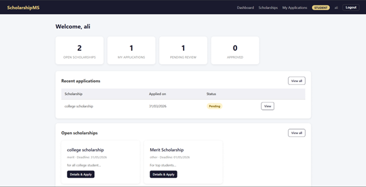
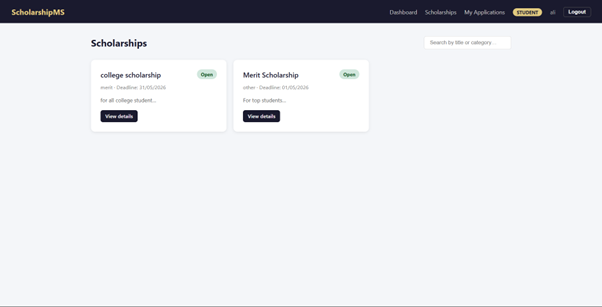
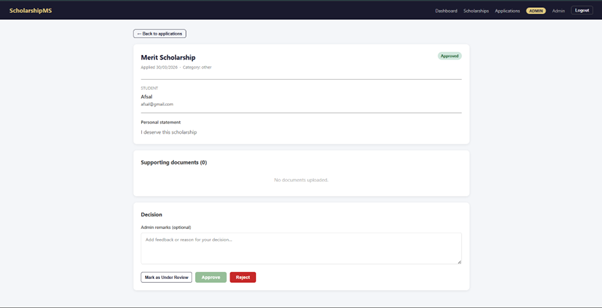
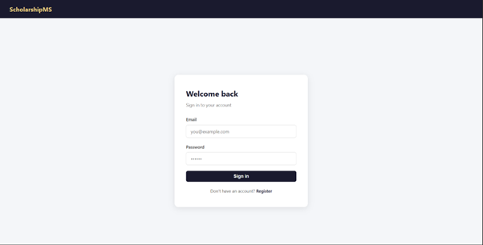
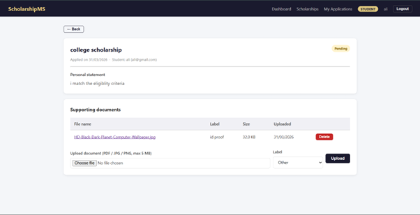
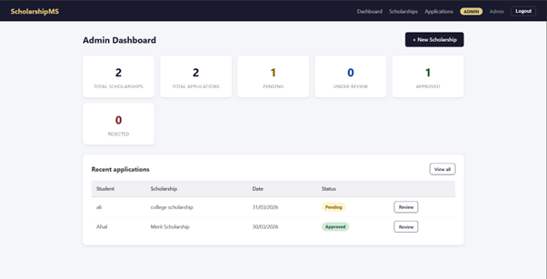

# 🎓 Student Scholarship Management System

A full-stack web application that streamlines the end-to-end scholarship lifecycle — from student discovery and application to admin review and decision-making.

Built using the **MERN stack** (MongoDB, Express, React, Node.js) with JWT-based authentication and role-based access control.

---

## 📸 Screenshots

> _Replace the placeholders below with actual screenshots before publishing._

| Student Dashboard | Scholarship Listing | Application Review |
|:-----------------:|:-------------------:|:-----------------:|
|  |  |  |

| Login Page | Document Upload | Admin Panel |
|:----------:|:---------------:|:-----------:|
|  |  |  |
---

## ✨ Features

### Student
- Register and log in securely with hashed passwords and JWT sessions
- Browse all active scholarships with search by title or category
- Apply with a personal statement; prevented from applying twice to the same scholarship
- Track application status in real time: `pending → under review → approved / rejected`
- Upload supporting documents (PDF, JPG, PNG) per application
- View admin remarks on reviewed applications
- Delete own uploaded documents

### Admin
- Create, edit, and deactivate scholarships
- View all applications with filter by status
- Review individual applications — student profile, statement, and uploaded documents side by side
- Approve, reject, or mark applications as under review
- Add remarks to communicate decisions back to students
- Full audit trail: reviewer name and timestamp recorded on each decision

---

## 🛠 Tech Stack

| Layer | Technology |
|---|---|
| **Frontend** | React 18, React Router v6, Axios |
| **Backend** | Node.js, Express.js |
| **Database** | MongoDB, Mongoose ODM |
| **Authentication** | JSON Web Tokens (JWT), bcryptjs |
| **File Uploads** | Multer (local disk storage) |
| **Styling** | Plain CSS (no external UI framework) |

---

## 📁 Project Structure

```
scholarship-system/
│
├── scholarship-backend/
│   ├── server.js                   # Express app entry point
│   ├── .env.example                # Environment variable template
│   ├── config/
│   │   └── db.js                   # MongoDB connection
│   ├── models/
│   │   ├── User.js                 # role: student | admin
│   │   ├── Scholarship.js          # title, description, eligibility, deadline, category
│   │   ├── Application.js          # status: pending | under_review | approved | rejected
│   │   └── Document.js             # label, filename, mimetype, size
│   ├── controllers/                # Business logic per module
│   ├── routes/                     # Express routers
│   ├── middleware/
│   │   └── authMiddleware.js       # protect · adminOnly · studentOnly
│   └── uploads/                    # Multer file destination
│
└── scholarship-frontend/
    ├── public/index.html
    └── src/
        ├── App.js                  # Route definitions
        ├── index.css               # Global styles
        ├── context/
        │   └── AuthContext.js      # Global auth state + token persistence
        ├── services/
        │   └── api.js              # Axios instance + all API calls
        ├── components/
        │   ├── Navbar.js           # Role-aware navigation
        │   ├── PrivateRoute.js     # Auth + role guards
        │   └── StatusBadge.js      # Colour-coded status pill
        └── pages/
            ├── Login.js / Register.js
            ├── StudentDashboard.js
            ├── ScholarshipList.js / ScholarshipDetail.js
            ├── MyApplications.js / ApplicationDetail.js
            ├── AdminDashboard.js
            ├── AdminScholarships.js
            ├── AdminApplications.js
            └── AdminApplicationReview.js
```

---

## 🚀 Getting Started

### Prerequisites

- Node.js v18+
- A MongoDB connection string ([MongoDB Atlas](https://www.mongodb.com/atlas) free tier works)

### 1. Backend

```bash
cd scholarship-backend
npm install
cp .env.example .env
```

Edit `.env` and fill in your values (see [Environment Variables](#environment-variables)), then:

```bash
npm run dev       # starts with nodemon on http://localhost:5000
```

### 2. Frontend

```bash
cd scholarship-frontend
npm install
npm start         # starts on http://localhost:3000
```

The React dev server proxies all `/api/*` requests to `localhost:5000` via the `"proxy"` field in `package.json` — no CORS configuration needed during development.

---

## 🔐 Environment Variables

Create a `.env` file in `scholarship-backend/` using `.env.example` as a template:

| Variable | Description | Example |
|---|---|---|
| `PORT` | Express server port | `5000` |
| `MONGO_URI` | MongoDB connection string | `mongodb+srv://...` |
| `JWT_SECRET` | Secret key for signing JWTs | any long random string |
| `NODE_ENV` | Runtime environment | `development` |

> ⚠️ Never commit `.env` to version control. It is listed in `.gitignore`.

---

## 📡 API Overview

All protected endpoints require an `Authorization: Bearer <token>` header.

### Auth — `/api/auth`

| Method | Endpoint | Access | Description |
|--------|----------|--------|-------------|
| POST | `/register` | Public | Create account |
| POST | `/login` | Public | Authenticate, receive token |
| GET | `/me` | Private | Get current user |
| PUT | `/profile` | Private | Update profile fields |

### Scholarships — `/api/scholarships`

| Method | Endpoint | Access | Description |
|--------|----------|--------|-------------|
| GET | `/` | Private | List scholarships (students: active only) |
| GET | `/:id` | Private | Get single scholarship |
| POST | `/` | Admin | Create scholarship |
| PUT | `/:id` | Admin | Update scholarship |
| DELETE | `/:id` | Admin | Delete scholarship |

### Applications — `/api/applications`

| Method | Endpoint | Access | Description |
|--------|----------|--------|-------------|
| POST | `/` | Student | Submit application |
| GET | `/mine` | Student | List own applications |
| GET | `/` | Admin | List all (filter: `?status=`) |
| GET | `/:id` | Private | Get single application |
| PUT | `/:id/status` | Admin | Approve / reject / set under review |

### Documents — `/api/documents`

| Method | Endpoint | Access | Description |
|--------|----------|--------|-------------|
| POST | `/upload` | Private | Upload file (form-data) |
| GET | `/:applicationId` | Private | Get documents for application |
| DELETE | `/file/:id` | Private | Delete own document |

Accepted file types: PDF, JPG, PNG · Max size: 5 MB

---

## 📝 Notes

- Passwords are hashed with **bcryptjs** before storage — never stored in plain text.
- JWT tokens expire after **7 days**; re-login is required after expiry.
- A student cannot apply to the same scholarship twice — enforced at both API and database level.
- Files are served statically from `uploads/` via Express — suitable for local development and small deployments.
- The `uploads/` directory is excluded from version control via `.gitignore`.

---

## 🔮 Future Improvements

- [ ] Email notifications on application status change (Nodemailer / SendGrid)
- [ ] Pagination for scholarship and application listings
- [ ] Student profile page with application history and document library
- [ ] Admin analytics dashboard (applications per scholarship, approval rate)
- [ ] Cloud file storage (Cloudinary or AWS S3) to replace local Multer storage
- [ ] Deployment pipeline (Render for backend, Vercel for frontend, MongoDB Atlas)
- [ ] Unit and integration tests (Jest + Supertest)

---

## 👤 Author

**[Afsal Ali]**

- GitHub: [@afsalashik224](https://github.com/afsalashik224)
- Email: afsalashik224@gmail.com

---

## 📄 License

This project is open source and available under the [MIT License](LICENSE).
